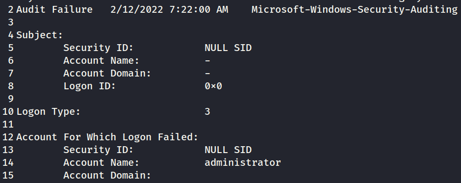
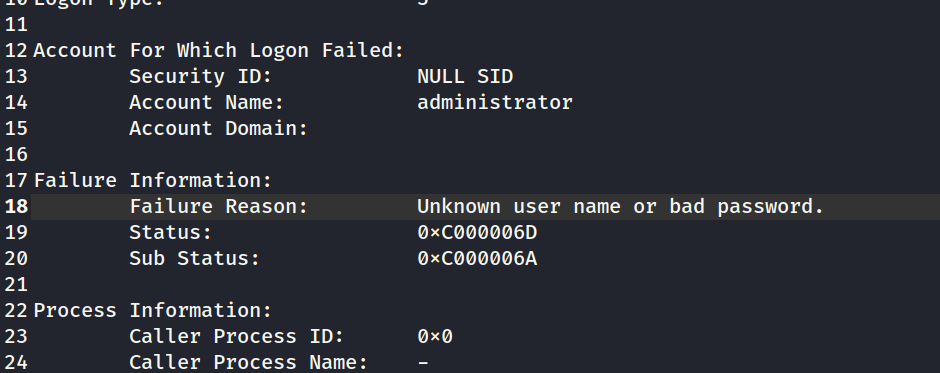
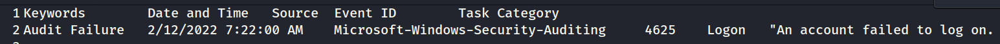
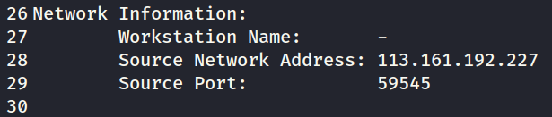
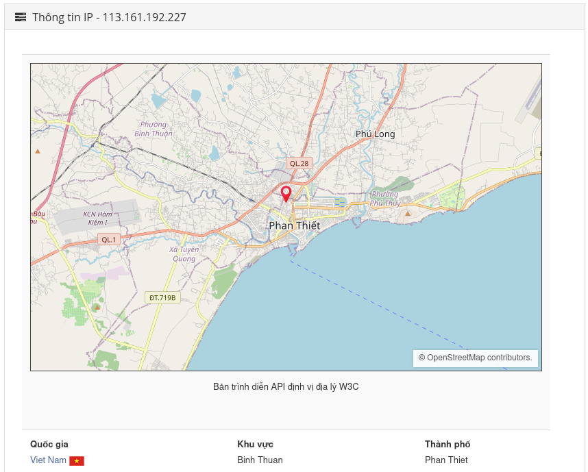
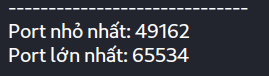

# Question 1) How many Audit Failure events are there? (Format: Count of Events)

# Question 2) What is the username of the local account that is being targeted?

# Question 3) What is the failure reason related to the Audit Failure logs?

# Question 4) What is the Windows Event ID associated with these logon failures?

# Question 5) What is the source IP conducting this attack?

# Question 6) What country is this IP address associated with?

# Question 7) What is the range of source ports that were used by the attacker to make these login requests?
