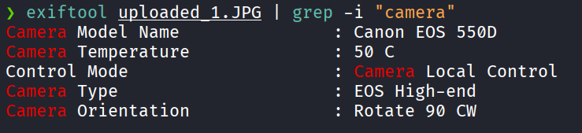
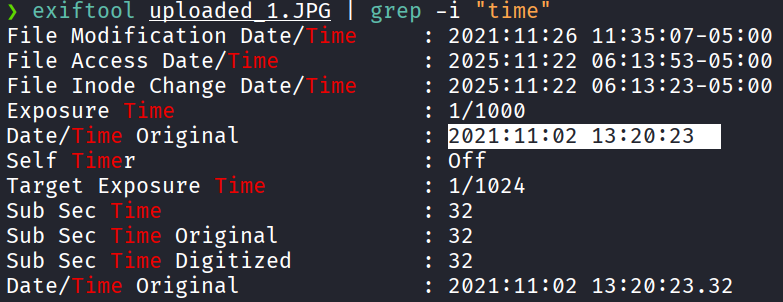
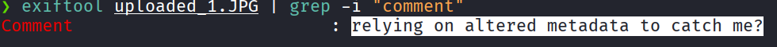
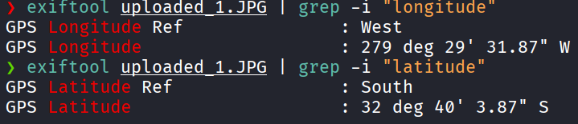
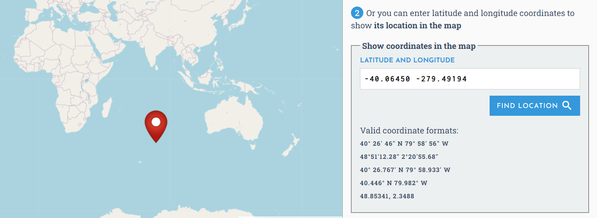
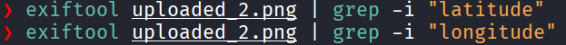
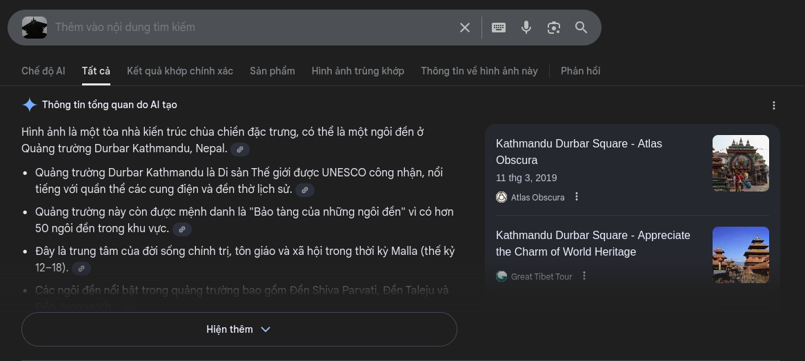

This challenge mainly uses exiftool to extract metadata from images

# Question 1) What is the camera model?

Answer: Canon EOS 550D

# Question 2) When was the picture taken?

Answer: 2021:11:02 13:20:23

# Question 3) What does the comment on the first image says?

Answer: relying on altered metadata to catch me?

# Question 4) Where could the criminal be?

Using exiftool, I extracted the GPS coordinates (longitude and latitude) from the first image:

However, looking up the location on a map led to nothing:

The second image does not contain GPS coordinates:

I attempted a reverse image search with Google Images:

Answer: Kathmandu