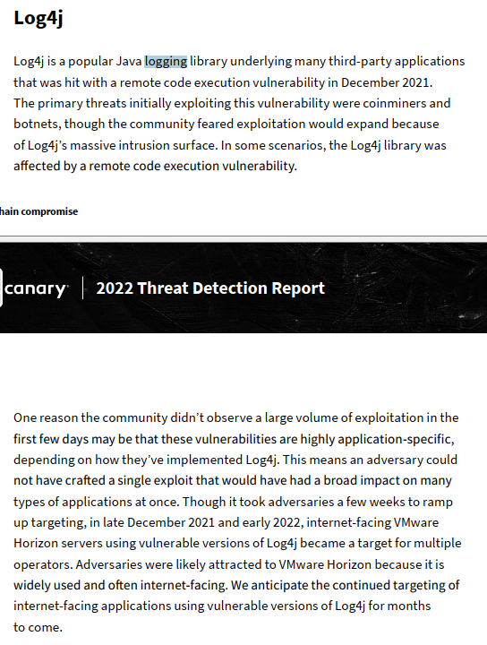
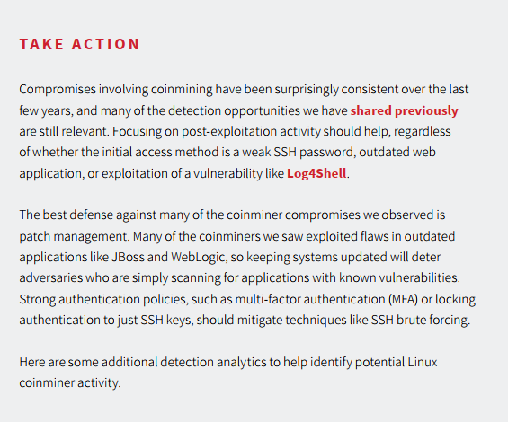
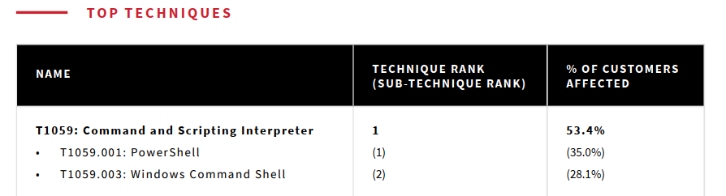
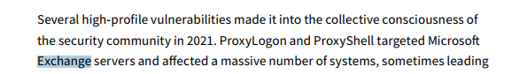
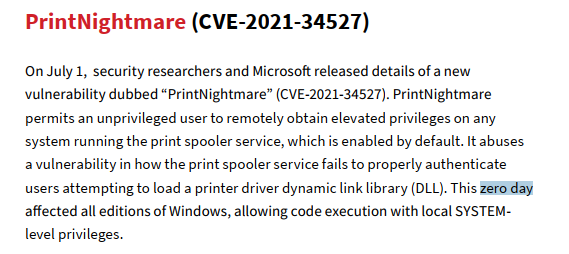
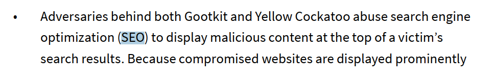
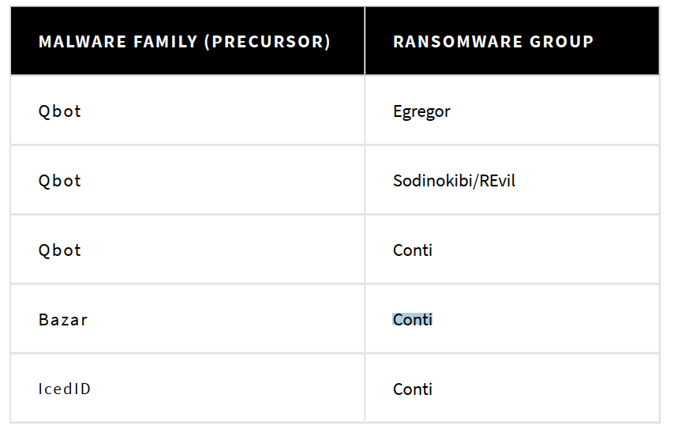
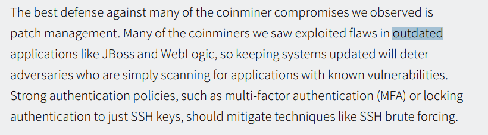
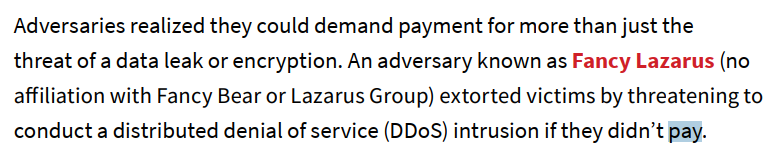
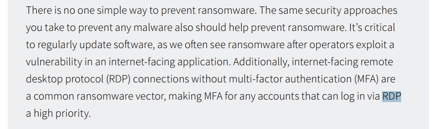

# Question 1) Name the supply chain attack related to Java logging library in the end of 2021

I search for the term "logging" and found the name of the library is Log4j

Continue with Log4j, I found this vulnerability named "Log4Shell"

Attempted to submit "Log4Shell" as the answer, but it was incorrect
Tried with "Log4j" and that was correct

Answer: Log4j

# Question 2) Mention the MITRE Technique ID which effected more than 50% of the customers

Answer: T1059

# Question 3) Submit the names of 2 vulnerabilities belonging to Exchange Servers

Answer: ProxyLogon, ProxyShell

# Question 4) Submit the CVE of the zero day vulnerability of a driver which led to RCE and gain SYSTEM privileges

Answer: CVE-2021-34527

# Question 5) Mention the 2 adversary groups that leverage SEO to gain initial access

Answer: Gootkit, Yellow Cockatoo

# Question 6) In the detection rule, what should be mentioned as parent process if we are looking for execution of malicious js files

By default, .js files are executed by the Windows Script Host (wscript.exe)

Answer: wscript.exe

# Question 7) Ransomware gangs started using affiliate model to gain initial access. Name the precursors used by affiliates of Conti ransomware group
 

Answer: Qbot, Bazar, IcedID

# Question 8) The main target of coin miners was outdated software. Mention the 2 outdated software mentioned in the report

Answer: JBoss, WebLogic

# Question 9) Name the ransomware group which threatened to conduct DDoS if they didn't pay ransom

Answer: Fancy Lazarus

# Question 10) What is the security measure we need to enable for RDP connections in order to safeguard from ransomware attacks?

Answer: MFA